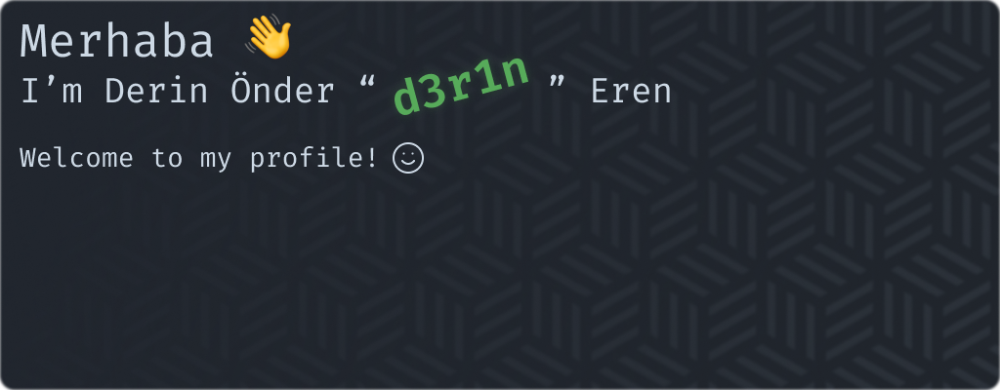

<div align=center>
  
  <br /> <br />
  
  
  <br /><br />
  
  <a href="https://github.com/d3r1n/dotman"></a>
  &nbsp;&nbsp;
  <a href="https://github.com/d3r1n/brainsuck"></a>
  
  <br />
  
  <a href="https://github.com/d3r1n/Rust-CHIP-8"></a>
  <br />
  
  
  <br /><br />
  <a href="https://discord.com/users/704758931343278162"></a>
  <br /><br />
  <a href="https://linkedin.com/in/d3r1n"></a>
  &nbsp;&nbsp;&nbsp;&nbsp;
  <a href="https://open.spotify.com/user/derin9999"></a>
  &nbsp;&nbsp;&nbsp;&nbsp;
  <a href="mailto:derinondereren@gmail.com"></a>
  <br /><br /><br/>
  
  &nbsp;
  <a href="https://wakatime.com/@5f971379-ccd6-465f-a0e1-6dfd0ade5512"></a>
</div>

<h2 align=center>📊 Weekly Development Breakdown</h2>

<!--START_SECTION:waka-->

```text
From: 23 November 2022 - To: 30 November 2022

Total Time: 4 hrs 50 mins

C#           3 hrs 20 mins   █████████████████▒░░░░░░░   69.14 %
Bash         25 mins         ██▒░░░░░░░░░░░░░░░░░░░░░░   08.71 %
Java         19 mins         █▓░░░░░░░░░░░░░░░░░░░░░░░   06.69 %
Text         15 mins         █▒░░░░░░░░░░░░░░░░░░░░░░░   05.36 %
XML          9 mins          ▓░░░░░░░░░░░░░░░░░░░░░░░░   03.24 %
Other        8 mins          ▓░░░░░░░░░░░░░░░░░░░░░░░░   02.92 %
```

<!--END_SECTION:waka-->
